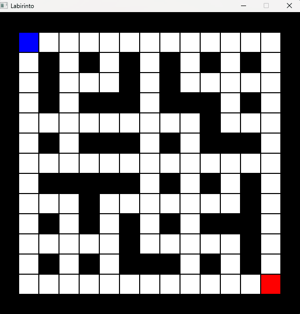

# Labirinto com Busca de Caminho usando A*

Projeto desenvolvido para a disciplina de Algoritmos em Grafos utilizando a linguagem C e a biblioteca SDL2. O sistema permite criar labirintos interativamente, definir pontos de início e fim, executar o algoritmo A* para encontrar o menor caminho e visualizar todo o processo de exploração dos nós em tempo real.

---



---

# Sobre o Projeto

O programa transforma um labirinto bidimensional em um grafo representado por matriz de adjacência. Cada célula livre do labirinto é tratada como um vértice, enquanto as conexões válidas entre células adjacentes representam as arestas.

A busca pelo menor caminho é realizada utilizando o algoritmo **A\*** (A-Star), combinando:

- **Custo real do caminho (G)**
- **Heurística de Manhattan (H)**
- **Função de avaliação F = G + H**

Além da execução do algoritmo, o projeto também:

- Exibe visualmente os nós visitados
- Anima o caminho encontrado
- Permite salvar e carregar labirintos
- Mede o número de comparações realizadas
- Permite alterar dinamicamente o tamanho do mapa

---

#  Funcionalidades

## Construção do labirinto
- Adicionar e remover paredes
- Definir ponto inicial
- Definir ponto final
- Resetar completamente o mapa

## Algoritmo de busca
- Conversão do labirinto para matriz de adjacência
- Execução do algoritmo A*
- Uso de fila de prioridade (Min Heap)
- Heurística de Manhattan
- Reconstrução do menor caminho

## Visualização gráfica
- Renderização em tempo real com SDL2
- Animação da ordem de visita dos nós
- Animação do caminho final
- Diferenciação visual entre:
  - paredes
  - células livres
  - origem
  - destino
  - nós visitados
  - caminho mínimo

## Persistência de dados
- Salvar labirintos em arquivos `.txt`
- Carregar labirintos previamente salvos

---

#  Estrutura do Projeto

```text
CaioGabrielArnaldo/
│
├── main.c                # Interface gráfica, eventos e renderização
├── pathfinding.c         # Implementação do algoritmo A*
├── pathfinding.h
├── linked_list.c         # Lista encadeada para reconstrução do caminho
├── linked_list.h
├── comparisons.c         # Contador de comparações
├── comparisons.h
├── SDL2.dll
├── SDL2_ttf.dll
│
├── executaveis/
│   ├── Trabalho_grafos.exe
│   ├── gerador_labirintos.exe
│   ├── 5x5.txt
│   ├── 25x25.txt
│   ├── 100x100.txt
│   ├── reto.txt
│   └── SemSaida.txt
```

---

# Interface e Controles

## Controles do mouse

| Ação | Função |
|---|---|
| Clique esquerdo | Adiciona/remove paredes |
| Clique direito | Define início e destino |

---

## Controles do teclado

| Tecla | Função |
|---|---|
| `E` | Executa o algoritmo A* |
| `N` | Cria um novo labirinto |
| `S` | Salva o labirinto |
| `L` | Carrega um labirinto |
| `Q` | Fecha o programa |

---

# Sistema de Cores

| Elemento | Cor |
|---|---|
| Parede | Preto |
| Caminho mínimo | Verde |
| Nós visitados | Laranja |
| Ponto inicial | Azul |
| Destino | Vermelho |
| Espaço livre | Branco |

---

# Requisitos

- GCC
- SDL2
- SDL2_ttf

---

# Execução

```text
Trabalho_grafos.exe
```

---

# Arquivos de Exemplo

O projeto já inclui labirintos prontos:

| Arquivo | Descrição |
|---|---|
| `5x5.txt` | Labirinto pequeno |
| `25x25.txt` | Labirinto médio |
| `100x100.txt` | Labirinto grande |
| `reto.txt` | Caminho direto |
| `SemSaida.txt` | Labirinto sem solução |
